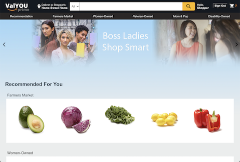
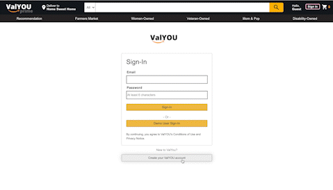
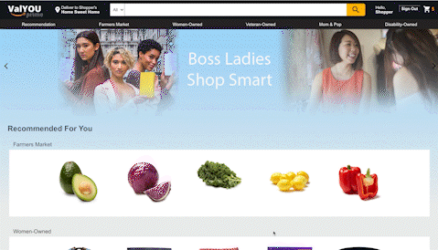
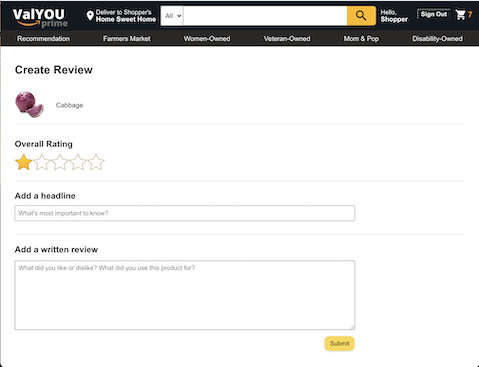
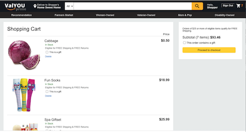

# ValYOU
[ValYOU](https://valyou.herokuapp.com) is a full-stack web application clone of Amazon. What makes ValYOU different from other e-commerce sites is that customers can shop for curated items exclusively from small businesses around the world. At ValYOU, supporting underrepresented communities and making the shopping experience as seamless as possible are my top priorities!

## Technologies
- React.js
- Redux.js
- Node.js
- Ruby on Rails
- PostgreSql 
- ActiveStorage
- Webpack
- Amazon AWS S3
- Heroku 

## Features

####  Homepage

Users are greeted with a slideshow of customized banners that represent the small businesses at ValYOU. Here, they can browse through the various items and select something they're interested in. They will then be redirected to the individual item show page where they can view more details, read reviews and potentially make a purchase.

#### User Authentication

Before users can add items to their cart, they need to sign-in or create an account with us. Passwords will be rehashed using BCrypt when they sign-in so they can rest assured that their user credentials are secured and that no one else has access to their personal shopping cart and review edits.

A demo account will be available for those who plan to create an account later but still want the full customer experience at ValYOU.

####  Search/Categories

Users can search for items by inputting keywords or clicking on specific categories located on the navigation bar. The items are queried through an Ajax request using JBuilder and ActiveRecord to match the inputted keyword for any related items.

####  Ratings/Reviews

Reviews are important for small businesses to grow. Users can rate, create and delete their published reviews whenever they're signed in.

####  Check out 

The number of items in the shopping cart is displayed on the navigation bar along with the user's sign-in status. Upon clicking on the cart icon, users can view the total cost of the items added. Here, users will have the option to mark each item as a gift or remove the item before proceeding to checkout. 

